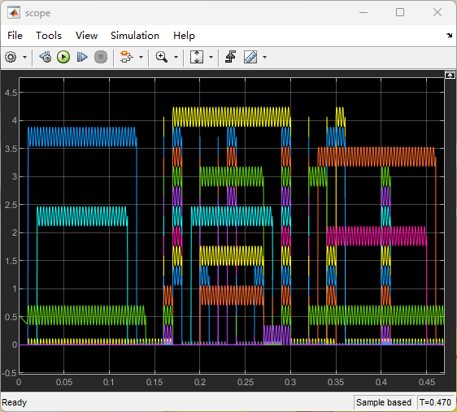

# 用示波器显示图片（Simulink仿真）
## 功能
读入一张图片，在Simulink中生成一个电路产生一系列波形，从而将这张图片展示到示波器上。输入图片分辨率太高会使仿真慢得不可接受。

原理说明：[知乎 - 怎么用示波器表白（仿真）](https://zhuanlan.zhihu.com/p/586935089)

## 运行环境
在MATLAB 2019和2020版本中可以正常运行，需要Simulink和Simscape组件。

在其他版本的MATLAB中可能会出现异常，主要原因可能是代码中给定的Simulink各元件路径在不同版本中有变化，尝试修正其路径即可。

## 例子
### 输入图片

### 生成电路

### 仿真结果 

